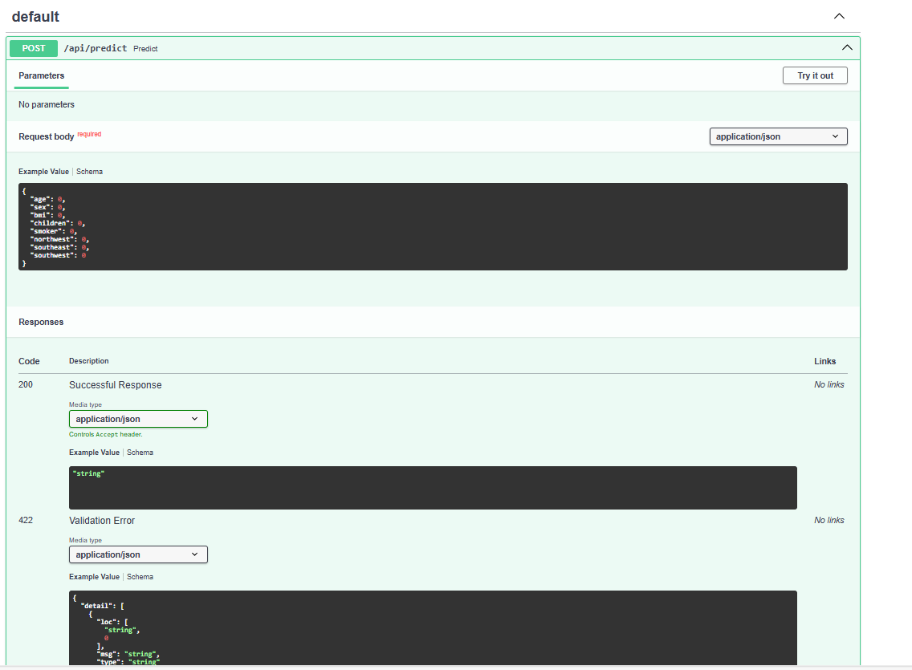

# Insurance Prediction API (FastAPI)
This project provides an API for predicting insurance charges based on user input using a trained machine learning model.

## Table of Contents
 - [Description](#description)
 - [Requirements](#requirements)
 - [Getting Started](#getting-started)
   - [1. Train and Save the Model](#1-train-and-save-the-model)
   - [2. Deploy FastAPI](#2-deploy-fastapi)
   - [3. Run Streamlit](#3-streamlit)
 - [Usage](#usage)
 - [Endpoints](#engpoints)
 - [Example Input and Output](#example-input-and-output)
 - [File Structure](#file-structure)
 - [License](#license)

## Decription
The FastAPI application loads the trained Logistic Regression model and exposes an endpoint for predicting insurance charges based on user's input. The model is trained on the following features:
- Age
- Gender
- BMI
- Number of Children
- Smoker Status
- Region

The API predicts insurance charges in USD based on these features.

## Requirements
To set up and run this this project, you will need the following python packages:

- 'fastapi'
- 'uvicorn'
- 'scikit-learn'
- 'pandas'
- 'joblib'
- 'numpy'
- 'streamlit'
- 'xgboost'

You can install these dependencies by running:

```bash
pip install -r requirements.text
```

## Getting Started
Follow these steps to set up and run the project.

1. Train and Save Model

Train the XGBoost Regression model using Scikit-Learn and XGBoost Regressor and save the trained model to files for deployment:
   ```bash
   python model_build.py
   ```
   This will create the `model.pkl` file in the `model/` directory.
2. Deploy FastAPI
The FastAPI application (`api.py`) loads the saved model and provides an endpoint for predictions. Run it using uvicorn:
uvicorn api:app --reload

This will start the FastAPI server at `http://127.0.0.1:8000`

## Endpoints


- POST /api/predict
- Description: Accepts insurance feature values and returns a predicted insurance charges in $.
- Input JSON:
```commandline
{
  "age": 30,
  "gender": male,
  "bmi": 25.3,
  "children": 4,
  "smoker": no,
  "region": "southwest"
}
```
- Output JSON:
```commandline
"predicted_charges": 5000.78
```

## Example Input and Output
Example Input:

Age = 45
Gender = Female
BMI = 28.7
Number of Children = 2
Smoker Status = Yes
Region = Southeast

Example Output:

Predicted Insurance Charges: $17,900.55

## File Structure

```commandline
📦 XGBoostRegressor API
├─ data
│  └─ data.csv
├─ model
│  └─ model.pkl
├─ src
├─ .gitignore
├─ api.py
├─ model_build.py
├─ README.md
└─ requirements.txt
```

## License
This project is licensed under [

